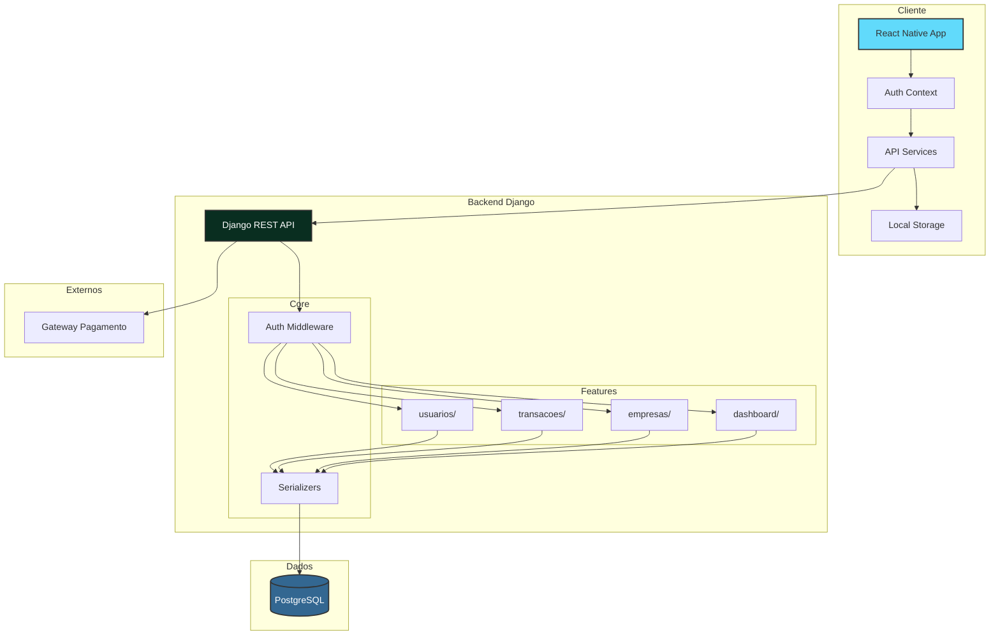
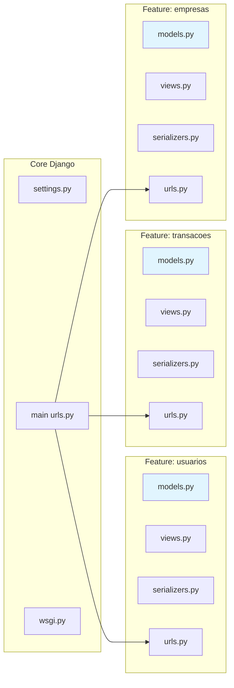
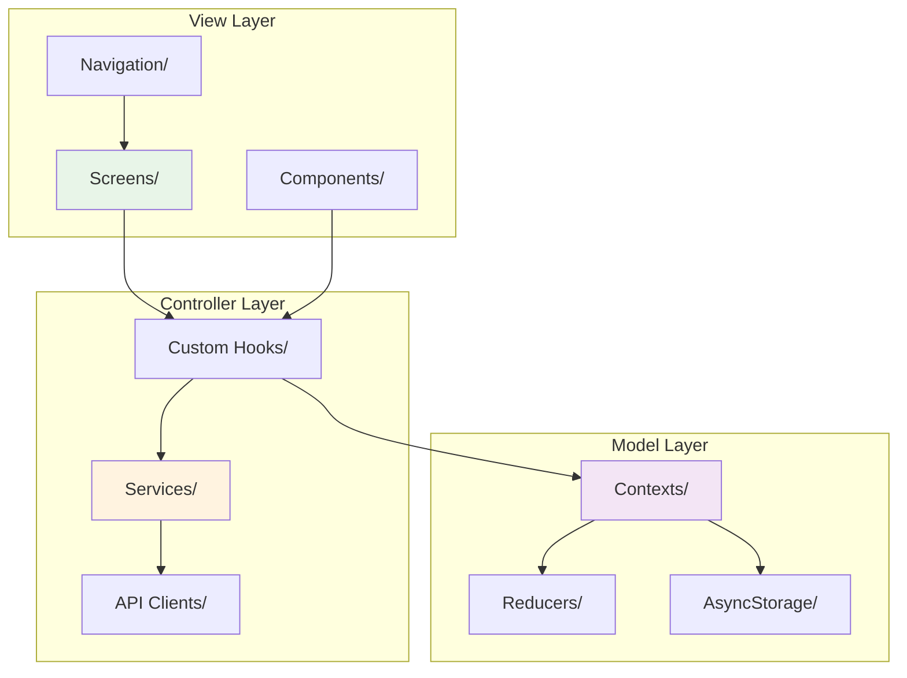
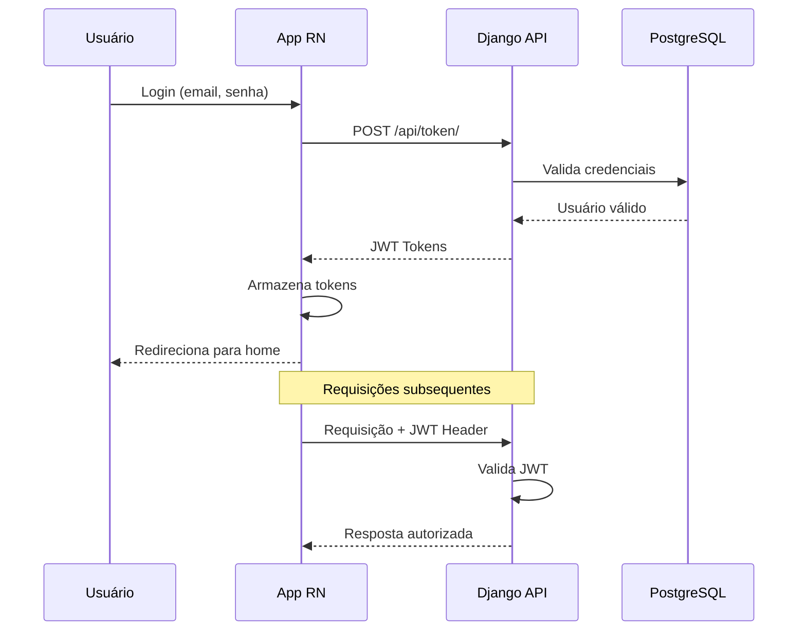
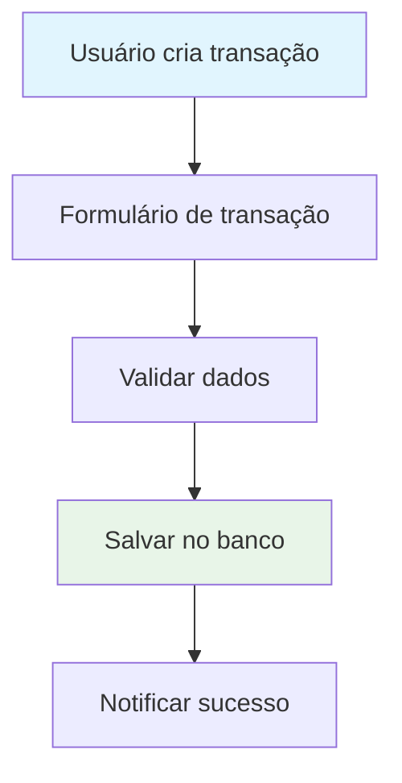
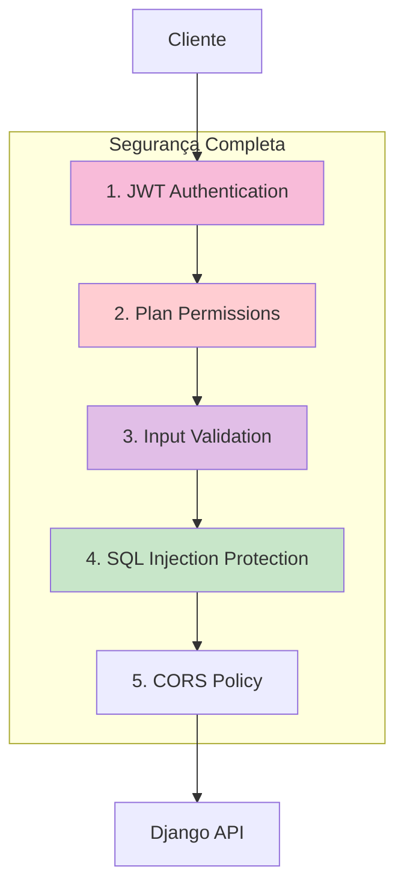
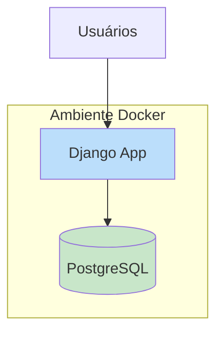

# Diagrama de Arquitetura - Gestão Financeira (MVP)

Este documento contém os diagramas de arquitetura do sistema - versão MVP.

## Arquitetura Geral do Sistema

```mermaid
graph TD
    subgraph "Ambiente Docker"
        subgraph "Backend (Django)"
            B1[Feature: Usuarios]
            B2[Feature: Transacoes]
            B3[Feature: Empresas]
            B4[Feature: Assinaturas]
            B5[Feature: Dashboard]
        end
        subgraph "Banco de Dados"
            C[(PostgreSQL)]
        end
    end

    A[App Mobile (React Native)] --> B1
    A --> B2
    A --> B3
    A --> B4
    A --> B5
    B1 --> C
    B2 --> C
    B3 --> C
    B4 --> C
    B5 --> C

    style A fill:#61DAFB,stroke:#333,stroke-width:2px
    style B1 fill:#092E20,stroke:#333,stroke-width:2px,color:#FFF
    style B2 fill:#092E20,stroke:#333,stroke-width:2px,color:#FFF
    style B3 fill:#092E20,stroke:#333,stroke-width:2px,color:#FFF
    style B4 fill:#092E20,stroke:#333,stroke-width:2px,color:#FFF
```

## Arquitetura Detalhada com Fluxo de Dados



## Estrutura de Features (Django)



## Arquitetura React Native (MVC)



## Fluxo de Autenticação



## Fluxo de Dados das Transações



## Camadas de Segurança



## Deployment Simples


