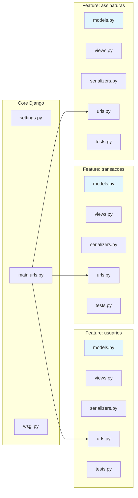
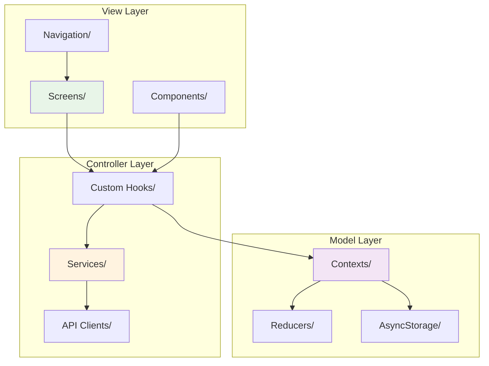
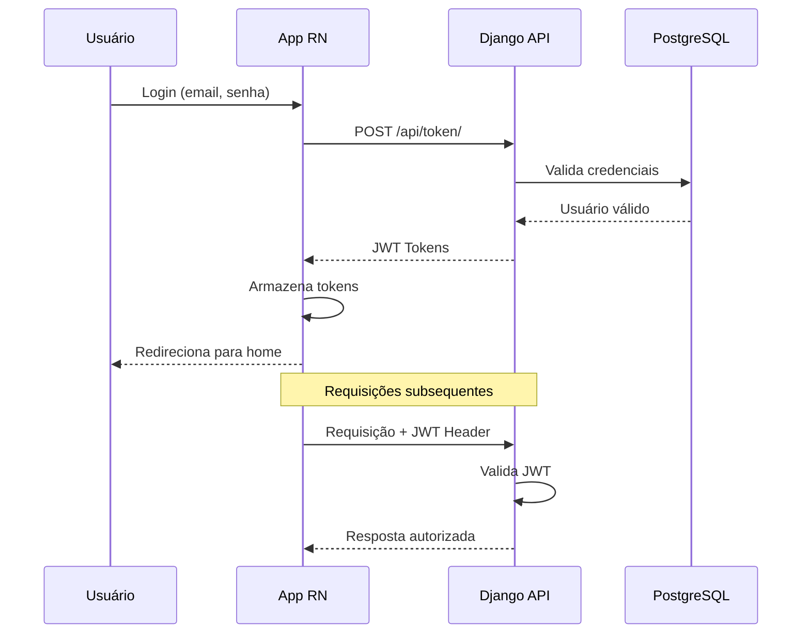
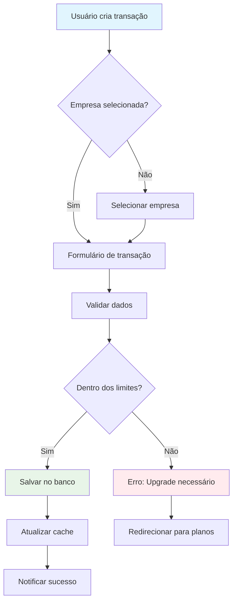
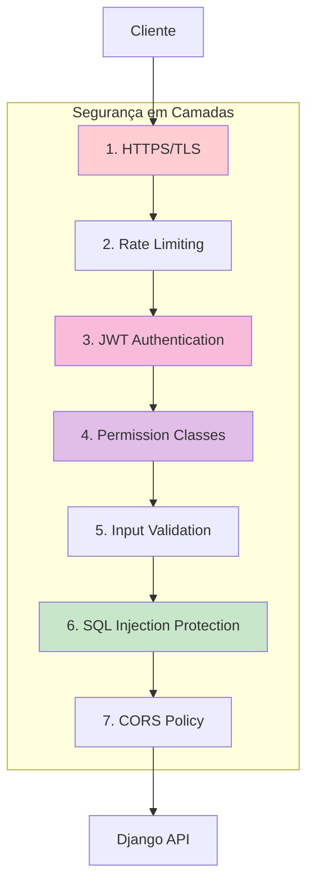
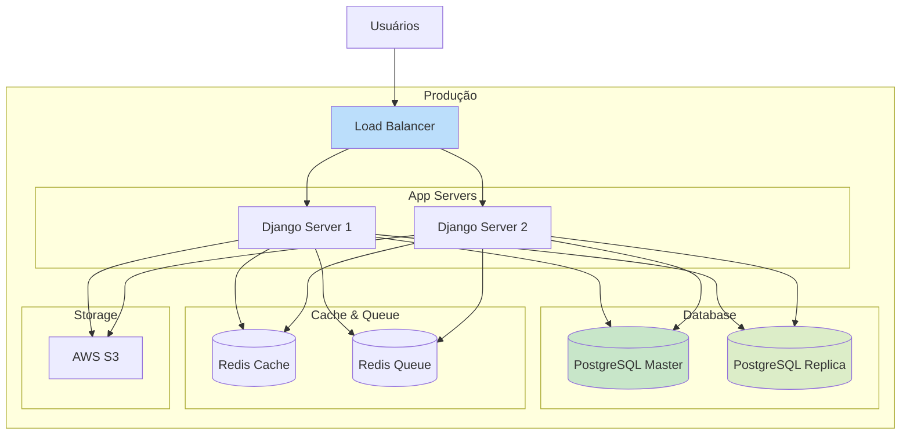
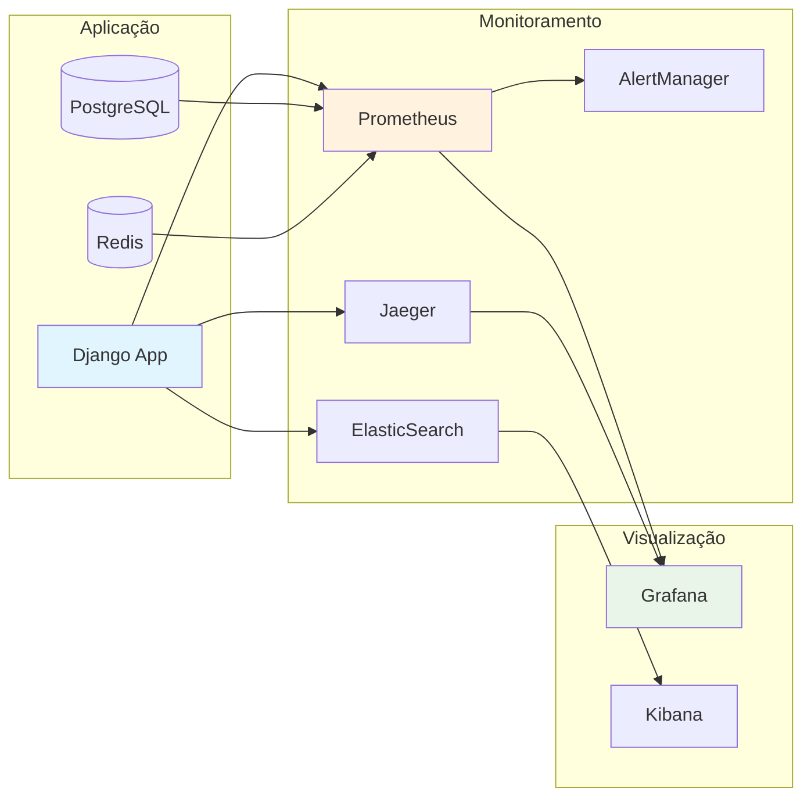

# Diagrama de Arquitetura - Gestão Financeira

Este documento contém os diagramas de arquitetura do sistema.

## Arquitetura Geral do Sistema

```mermaid
graph TD
    subgraph "Ambiente Docker"
        subgraph "Backend (Django)"
            B1[Feature: Usuarios]
            B2[Feature: Transacoes]
            B3[Feature: Assinaturas]
            B4[Feature: Empresas]
            B5[Feature: Relatorios]
        end
        subgraph "Banco de Dados"
            C[(PostgreSQL)]
        end
    end

    A[App Mobile (React Native)] --> B1
    A --> B2
    A --> B3
    A --> B4
    A --> B5
    B1 --> C
    B2 --> C
    B3 --> C
    B4 --> C
    B5 --> C

    style A fill:#61DAFB,stroke:#333,stroke-width:2px
    style B1 fill:#092E20,stroke:#333,stroke-width:2px,color:#FFF
    style B2 fill:#092E20,stroke:#333,stroke-width:2px,color:#FFF
    style B3 fill:#092E20,stroke:#333,stroke-width:2px,color:#FFF
    style B4 fill:#092E20,stroke:#333,stroke-width:2px,color:#FFF
    style B5 fill:#092E20,stroke:#333,stroke-width:2px,color:#FFF
```

## Arquitetura Detalhada com Fluxo de Dados

```mermaid
graph TB
    subgraph "Cliente"
        RN[React Native App]
        RN_AUTH[Auth Context]
        RN_API[API Services]
        RN_STORE[Local Storage]
    end

    subgraph "Rede"
        HTTPS[HTTPS/SSL]
        JWT[JWT Tokens]
    end

    subgraph "Backend Django"
        NGINX[Nginx (Proxy)]
        DJANGO[Django REST API]
        
        subgraph "Features"
            F_USER[usuarios/]
            F_TRANS[transacoes/]
            F_SUB[assinaturas/]
            F_COMP[empresas/]
            F_REP[relatorios/]
        end
        
        subgraph "Core"
            MIDDLEWARE[Auth Middleware]
            PERMISSIONS[Permission Classes]
            SERIALIZERS[Serializers]
        end
    end

    subgraph "Dados"
        POSTGRES[(PostgreSQL)]
        REDIS[(Redis Cache)]
    end

    subgraph "Externos"
        EMAIL[Serviço de Email]
        PAYMENT[Gateway Pagamento]
    end

    RN --> RN_AUTH
    RN_AUTH --> RN_API
    RN_API --> HTTPS
    HTTPS --> NGINX
    NGINX --> DJANGO
    
    DJANGO --> MIDDLEWARE
    MIDDLEWARE --> PERMISSIONS
    PERMISSIONS --> F_USER
    PERMISSIONS --> F_TRANS
    PERMISSIONS --> F_SUB
    PERMISSIONS --> F_COMP
    PERMISSIONS --> F_REP
    
    F_USER --> SERIALIZERS
    F_TRANS --> SERIALIZERS
    F_SUB --> SERIALIZERS
    F_COMP --> SERIALIZERS
    F_REP --> SERIALIZERS
    
    SERIALIZERS --> POSTGRES
    DJANGO --> REDIS
    DJANGO --> EMAIL
    DJANGO --> PAYMENT
    
    RN_API --> RN_STORE

    style RN fill:#61DAFB,stroke:#333,stroke-width:2px
    style DJANGO fill:#092E20,stroke:#333,stroke-width:2px,color:#FFF
    style POSTGRES fill:#336791,stroke:#333,stroke-width:2px,color:#FFF
    style REDIS fill:#DC382D,stroke:#333,stroke-width:2px,color:#FFF
```

## Estrutura de Features (Django)



## Arquitetura React Native (MVC)



## Fluxo de Autenticação



## Fluxo de Dados das Transações



## Camadas de Segurança



## Deployment Architecture



## Monitoramento e Observabilidade


