# Backend Documentation - Django REST Framework (MVP)

Documentação visual e técnica do backend Django REST Framework para o sistema de gestão financeira.

## 🐍 Visão Geral

Backend desenvolvido em Django REST Framework seguindo arquitetura Feature Folder com padrão MVC, focado nas funcionalidades essenciais para o MVP.

## 🏗️ Arquitetura Visual

### Estrutura Feature Folder
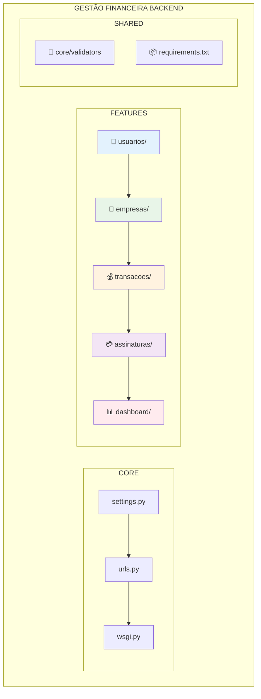

### Padrão MVC por Feature
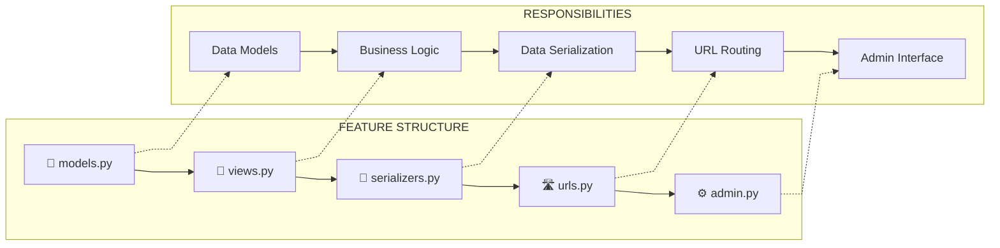

## 📊 Modelo de Dados Visual

### Relacionamentos Principais
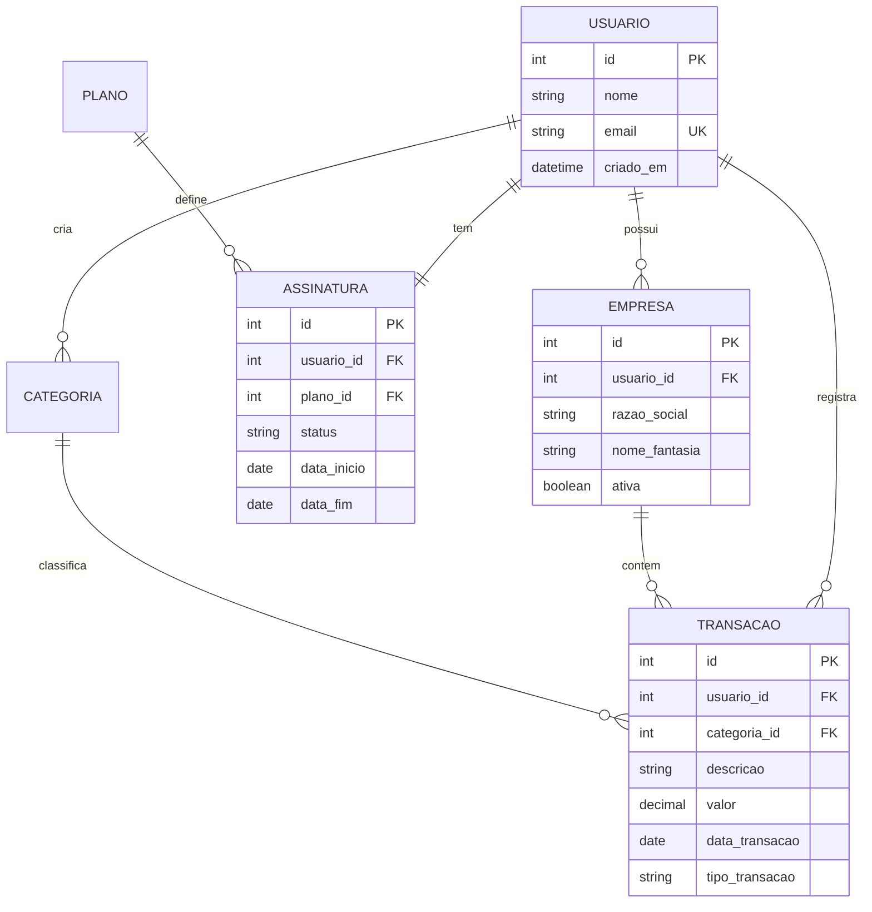

### Fluxo de Dados
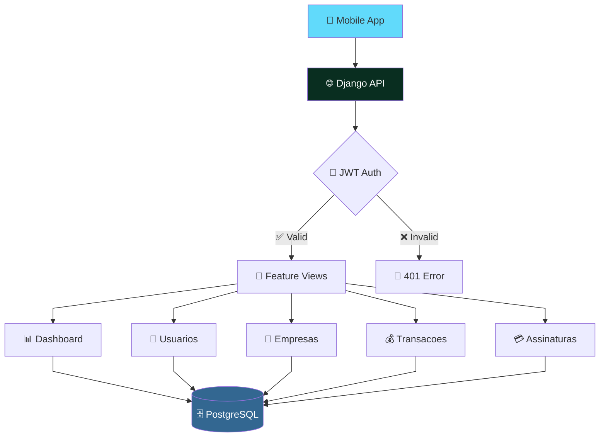

## 🔐 Sistema de Autenticação

### Fluxo JWT
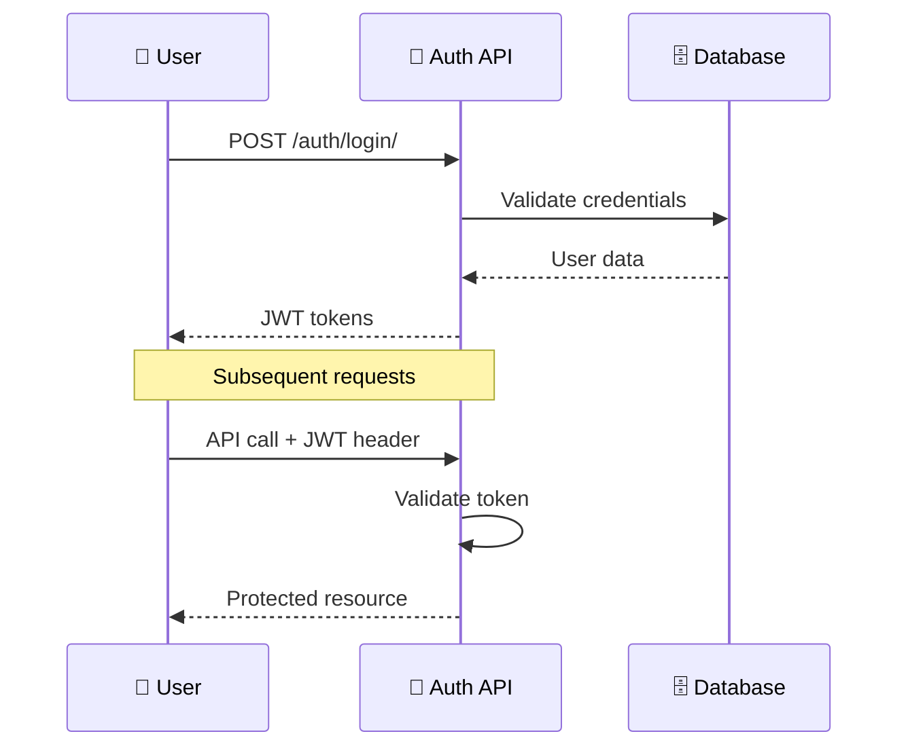

### Níveis de Permissão
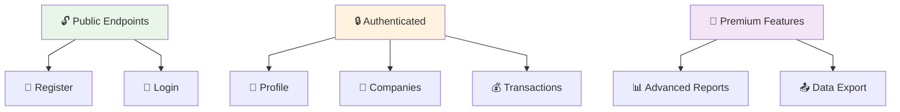

## 💳 Sistema de Assinaturas

### Planos e Limites
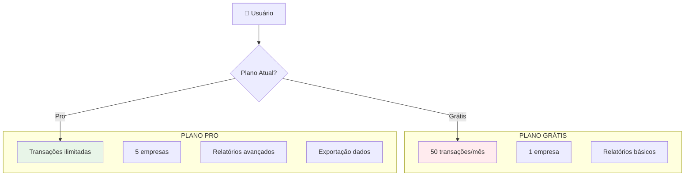

### Fluxo de Upgrade
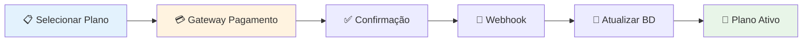

## 📊 API Endpoints Visuais

### Estrutura de URLs
```
📍 API BASE: /api/v1/

🔐 AUTENTICAÇÃO
├── POST /auth/login/          # Login usuário
├── POST /auth/register/       # Registro
└── POST /auth/refresh/        # Refresh token

👤 USUÁRIOS
├── GET  /users/profile/       # Perfil atual
└── PUT  /users/profile/       # Atualizar perfil

🏢 EMPRESAS
├── GET  /empresas/            # Listar empresas
└── POST /empresas/            # Criar empresa

💰 TRANSAÇÕES
├── GET  /transacoes/          # Listar transações
├── POST /transacoes/          # Criar transação
├── PUT  /transacoes/{id}/     # Atualizar
└── DEL  /transacoes/{id}/     # Excluir

🏷️ CATEGORIAS
├── GET  /categorias/          # Listar categorias
└── POST /categorias/          # Criar categoria

💳 ASSINATURAS
├── GET  /planos/              # Listar planos
├── GET  /assinaturas/atual/   # Assinatura atual
└── POST /assinaturas/upgrade/ # Fazer upgrade

📊 DASHBOARD
└── GET  /dashboard/           # Dados resumo
```

### Códigos de Resposta
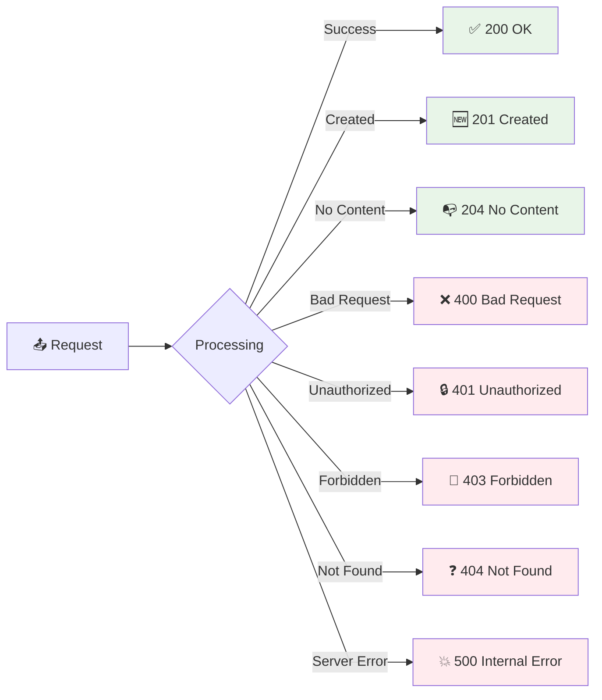

## ⚡ Performance e Otimizações

### Estratégias de Cache
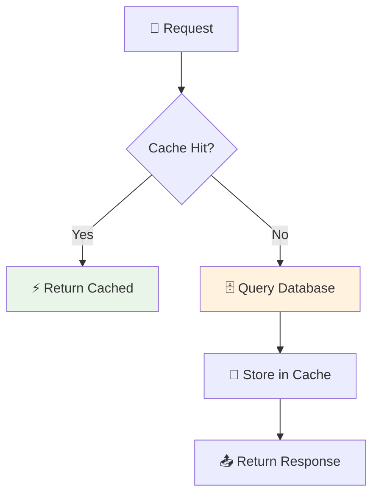

### Otimizações de Query
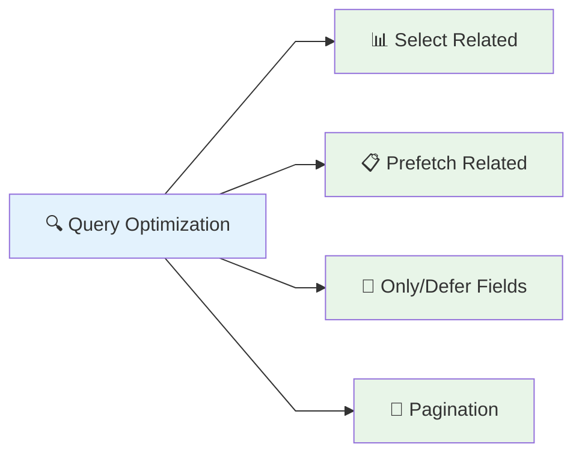

## 🐳 Deploy e Infraestrutura

### Arquitetura de Deploy
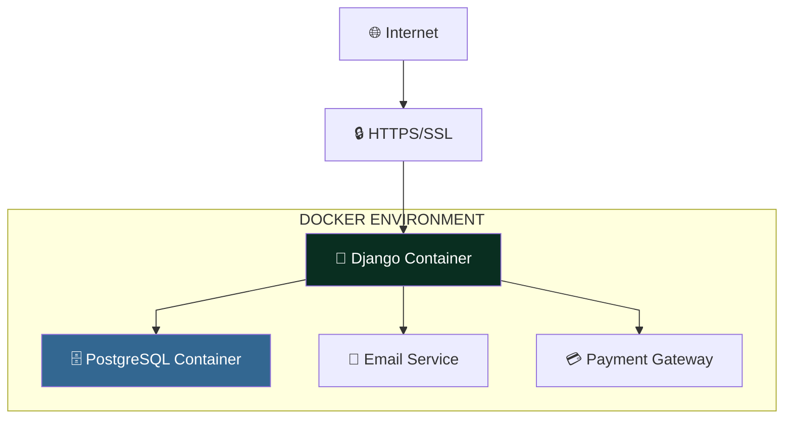

### Configuração Simples
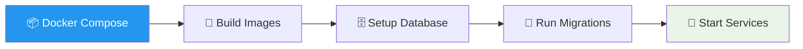

## 📈 Monitoramento

### Métricas Principais
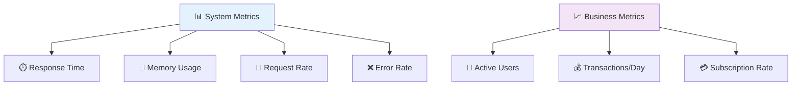

### Health Check
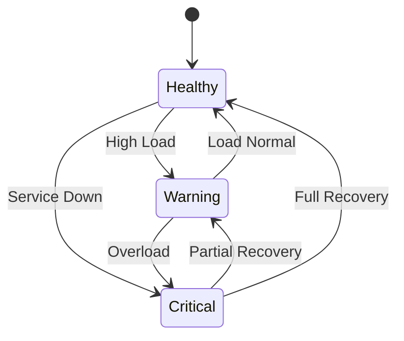

## 🔧 Comandos Úteis

### Desenvolvimento
```
🛠️ COMANDOS ESSENCIAIS

📦 Setup
├── docker-compose up --build    # Iniciar ambiente
├── python manage.py migrate     # Aplicar migrações
└── python manage.py runserver   # Servidor dev

🗄️ Database
├── python manage.py makemigrations  # Criar migrações
├── python manage.py createsuperuser # Admin user
└── python manage.py shell           # Shell interativo

🐳 Docker
├── docker-compose logs -f backend   # Ver logs
├── docker-compose exec backend bash # Acessar container
└── docker-compose down              # Parar serviços
```

## 📋 Checklist de Qualidade

### Padrões Implementados
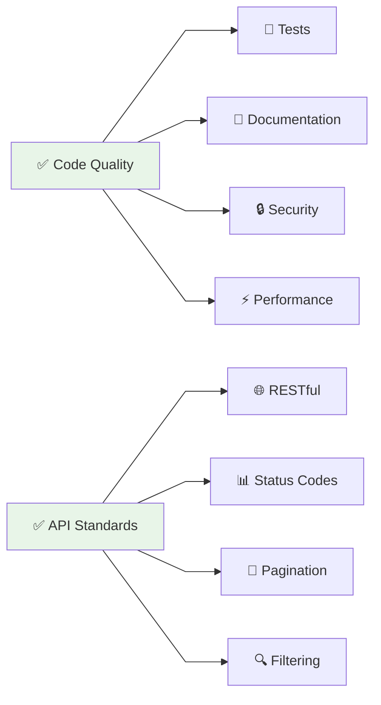

### Segurança
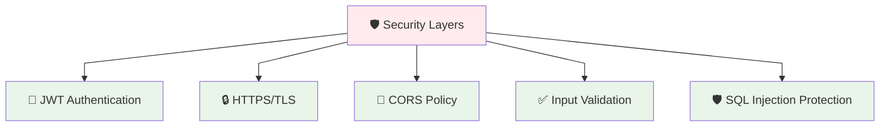

---

💡 **Foco**: Arquitetura robusta, performance otimizada e segurança em todas as camadas do backend.