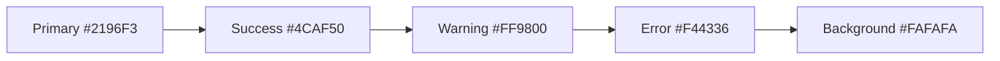
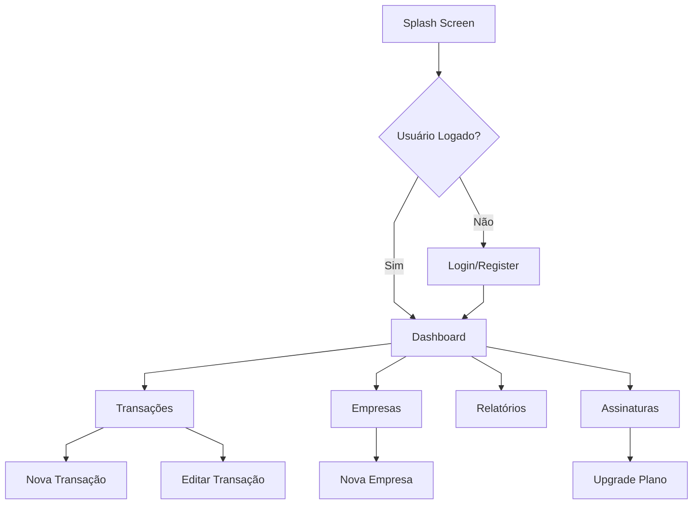
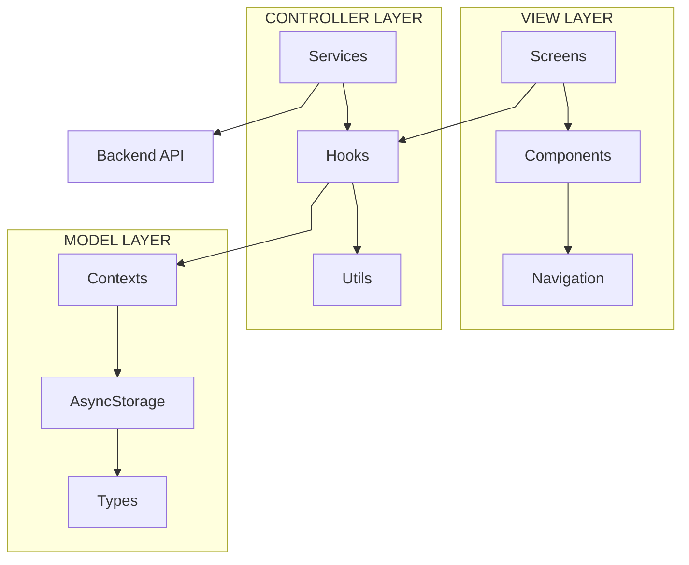
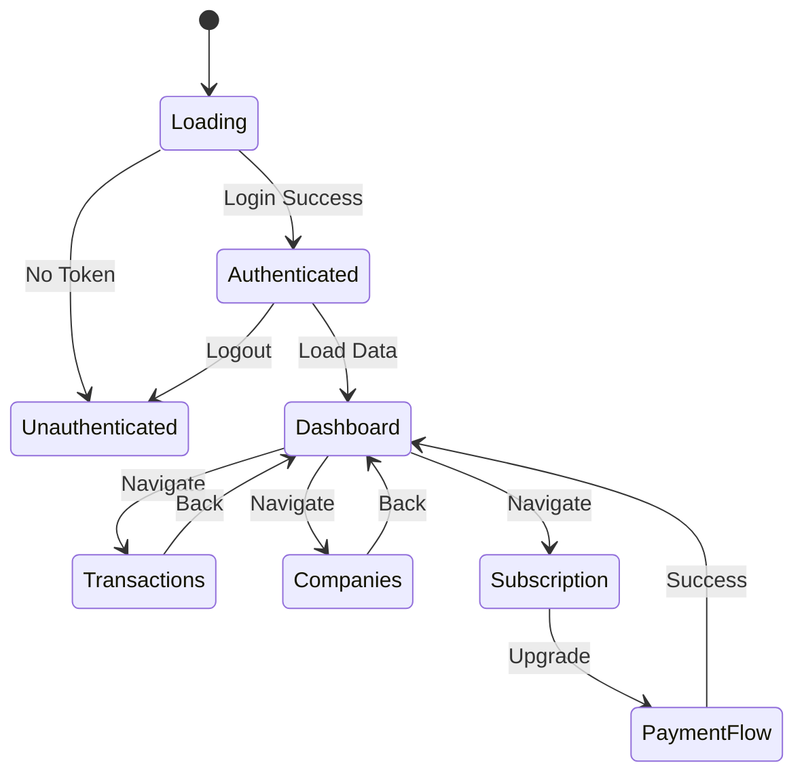
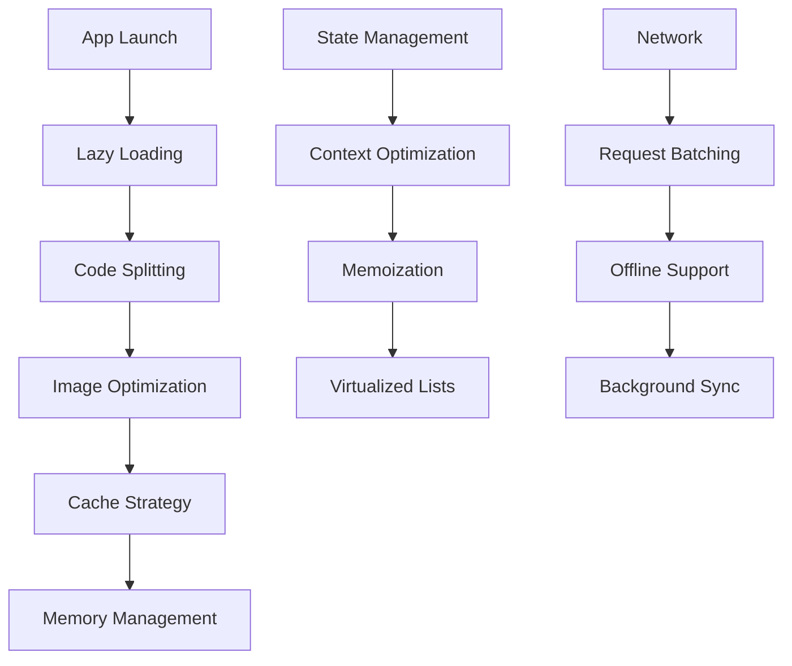
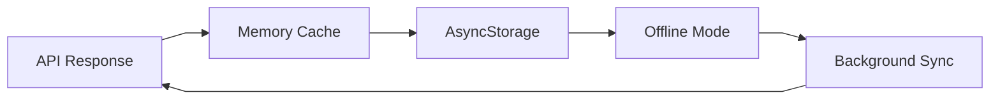
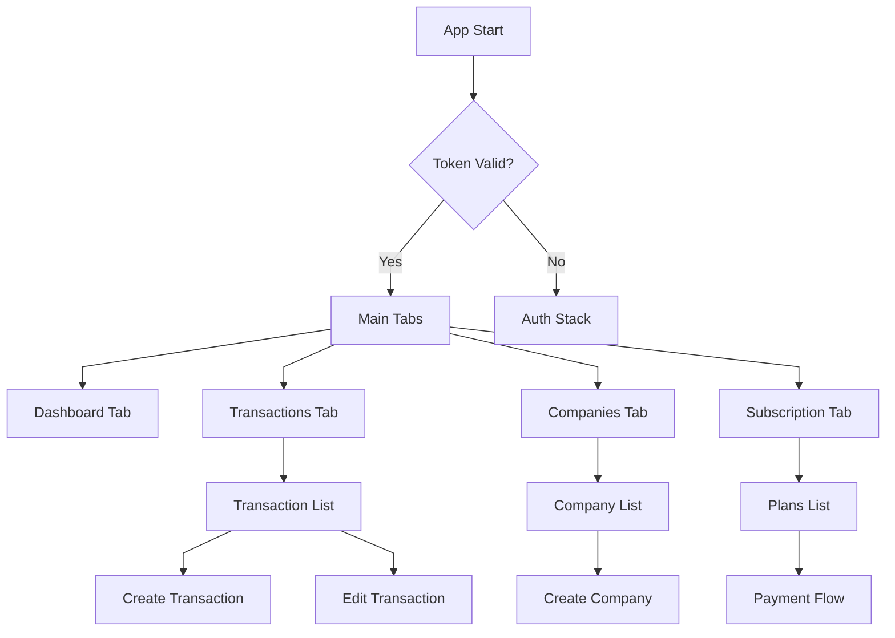
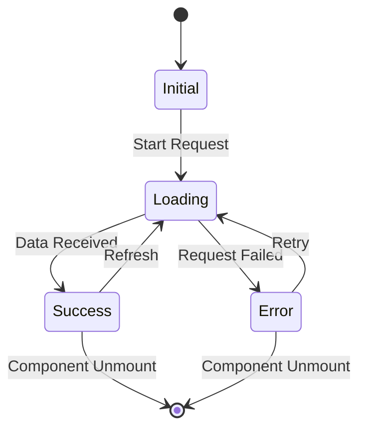

# Frontend Documentation - React Native

Documentação visual e técnica do aplicativo mobile React Native para o sistema de gestão financeira.

## 📱 Visão Geral

App mobile desenvolvido em React Native com arquitetura MVC, focado em performance e experiência do usuário.

## 🎨 Design System & Telas

### Paleta de Cores


### Fluxo de Telas


## 🏗️ Arquitetura Visual

### Estrutura MVC


### Gerenciamento de Estado


## 📱 Mockups das Telas

### Tela de Login
```
┌─────────────────────────────────┐
│  🏦 Gestão Financeira          │
├─────────────────────────────────┤
│                                 │
│     📧 Email                    │
│     ┌─────────────────────────┐ │
│     │ usuario@email.com       │ │
│     └─────────────────────────┘ │
│                                 │
│     🔒 Senha                    │
│     ┌─────────────────────────┐ │
│     │ ••••••••••••••••        │ │
│     └─────────────────────────┘ │
│                                 │
│     ┌─────────────────────────┐ │
│     │       ENTRAR            │ │
│     └─────────────────────────┘ │
│                                 │
│     Esqueceu a senha?           │
│     Criar nova conta            │
└─────────────────────────────────┘
```

### Dashboard Principal
```
┌─────────────────────────────────┐
│ ☰ Dashboard        🔔 👤       │
├─────────────────────────────────┤
│ 💳 Plano: Pro (Ativo)          │
│ ┌─────────────────────────────┐ │
│ │ 📈 RESUMO FINANCEIRO        │ │
│ │ ┌─────┐ ┌─────┐ ┌─────┐    │ │
│ │ │💚   │ │🔴   │ │💙   │    │ │
│ │ │15.7K│ │8.9K │ │6.8K │    │ │
│ │ │Entr.│ │Saíd.│ │Sald.│    │ │
│ │ └─────┘ └─────┘ └─────┘    │ │
│ └─────────────────────────────┘ │
│                                 │
│ 📊 CATEGORIAS                   │
│ ┌─────────────────────────────┐ │
│ │    🥧 Gráfico Pizza         │ │
│ │   Vendas: 79.4%             │ │
│ │   Serviços: 20.6%           │ │
│ └─────────────────────────────┘ │
├─────────────────────────────────┤
│ 🏠 📊 💰 📋 ⚙️                │
└─────────────────────────────────┘
```

### Lista de Transações
```
┌─────────────────────────────────┐
│ ← Transações           + 🔍     │
├─────────────────────────────────┤
│ 📅 Filtros: Hoje | Semana      │
│ 💰 Tipo: Todas | Entrada       │
├─────────────────────────────────┤
│ ┌─────────────────────────────┐ │
│ │ 💚 Venda Produto X          │ │
│ │    R$ 1.500,00              │ │
│ │    📅 21/08 • 🏷️ Vendas     │ │
│ └─────────────────────────────┘ │
│ ┌─────────────────────────────┐ │
│ │ 🔴 Pagamento Fornecedor     │ │
│ │    R$ 800,50                │ │
│ │    📅 20/08 • 🏷️ Compras    │ │
│ └─────────────────────────────┘ │
│ ┌─────────────────────────────┐ │
│ │ 💚 Serviço Consultoria      │ │
│ │    R$ 2.000,00              │ │
│ │    📅 19/08 • 🏷️ Serviços   │ │
│ └─────────────────────────────┘ │
├─────────────────────────────────┤
│ 🏠 📊 💰 📋 ⚙️                │
└─────────────────────────────────┘
```

### Formulário Nova Transação
```
┌─────────────────────────────────┐
│ ← Nova Transação        ✓       │
├─────────────────────────────────┤
│ 📝 Descrição *                  │
│ ┌─────────────────────────────┐ │
│ │ Venda de produto...         │ │
│ └─────────────────────────────┘ │
│                                 │
│ 💰 Valor *                      │
│ ┌─────────────────────────────┐ │
│ │ R$ 1.500,00                 │ │
│ └─────────────────────────────┘ │
│                                 │
│ 📅 Data                         │
│ ┌─────────────────────────────┐ │
│ │ 21/08/2025                  │ │
│ └─────────────────────────────┘ │
│                                 │
│ 🔄 Tipo                         │
│ ┌─────────────────────────────┐ │
│ │ ● Entrada  ○ Saída          │ │
│ └─────────────────────────────┘ │
│                                 │
│ 🏷️ Categoria                    │
│ ┌─────────────────────────────┐ │
│ │ Vendas ▼                    │ │
│ └─────────────────────────────┘ │
│                                 │
│ ┌─────────────────────────────┐ │
│ │        SALVAR               │ │
│ └─────────────────────────────┘ │
└─────────────────────────────────┘
```

### Tela de Assinaturas
```
┌─────────────────────────────────┐
│ ← Planos e Assinaturas          │
├─────────────────────────────────┤
│ 💳 Plano Atual: GRÁTIS          │
│ ┌─────────────────────────────┐ │
│ │ ⚠️ Limite: 45/50 transações │ │
│ │    Restam apenas 5!         │ │
│ └─────────────────────────────┘ │
│                                 │
│ 📋 PLANOS DISPONÍVEIS           │
│ ┌─────────────────────────────┐ │
│ │ 🆓 GRÁTIS                   │ │
│ │ • 50 transações/mês         │ │
│ │ • 1 empresa                 │ │
│ │ • Relatórios básicos        │ │
│ │ ┌─────────────────────────┐ │ │
│ │ │    PLANO ATUAL          │ │ │
│ │ └─────────────────────────┘ │ │
│ └─────────────────────────────┘ │
│ ┌─────────────────────────────┐ │
│ │ 💎 PRO - R$ 29,90/mês       │ │
│ │ • Transações ilimitadas     │ │
│ │ • 5 empresas                │ │
│ │ • Relatórios avançados      │ │
│ │ • Exportação dados          │ │
│ │ ┌─────────────────────────┐ │ │
│ │ │      FAZER UPGRADE      │ │ │
│ │ └─────────────────────────┘ │ │
│ └─────────────────────────────┘ │
└─────────────────────────────────┘
```

## ⚡ Performance & Otimizações

### Estratégias de Performance


### Gerenciamento de Estado Otimizado
```javascript
// Estrutura de Contexts otimizada
const AppProviders = ({ children }) => (
  <AuthProvider>
    <SubscriptionProvider>
      <CompanyProvider>
        <TransactionProvider>
          {children}
        </TransactionProvider>
      </CompanyProvider>
    </SubscriptionProvider>
  </AuthProvider>
);
```

### Cache e Persistência


## 🔄 Fluxos de Navegação

### Navegação Principal


### Estados de Loading


## 📊 Componentes de Visualização

### Gráficos Implementados
- **Gráfico Pizza**: Distribuição por categorias
- **Gráfico Linha**: Evolução temporal
- **Cards Resumo**: Métricas principais
- **Barras Progresso**: Limites de plano

### Responsividade
```
📱 Mobile (320-480px)
├── Layout Stack
├── Cards Full Width
└── Navigation Bottom

📱 Tablet (768px+)
├── Layout Grid 2 Cols
├── Cards Side by Side
└── Navigation Side
```

## 🔧 Configuração Técnica

### Dependências Principais
```json
{
  "react-native": "0.72.x",
  "@react-navigation/native": "^6.x",
  "@react-native-async-storage/async-storage": "^1.x",
  "react-native-chart-kit": "^6.x",
  "axios": "^1.x"
}
```

### Estrutura de Arquivos Otimizada
```
src/
├── components/
│   ├── UI/           # Componentes base
│   ├── Charts/       # Visualizações
│   └── Forms/        # Formulários
├── screens/          # Telas organizadas
├── navigation/       # Configuração rotas
├── contexts/         # Estado global
├── services/         # APIs
├── hooks/           # Lógica reutilizável
└── utils/           # Helpers
```

## 🎯 Métricas de UX

### Tempos de Resposta
- **Login**: < 2s
- **Dashboard Load**: < 3s
- **Transaction Create**: < 1s
- **Navigation**: < 500ms

### Indicadores Visuais
- **Loading States**: Skeleton screens
- **Error States**: Mensagens claras
- **Success States**: Feedback visual
- **Empty States**: Orientações úteis

---

💡 **Foco**: Interface intuitiva, performance otimizada e experiência fluida para gestão financeira mobile.