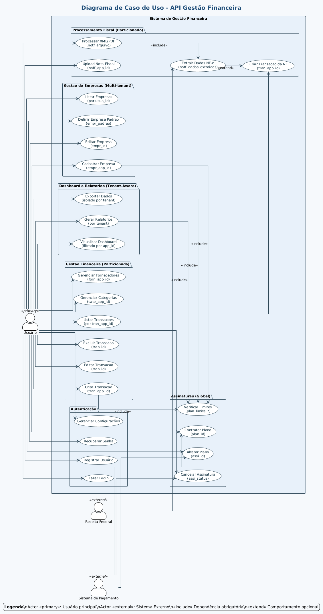
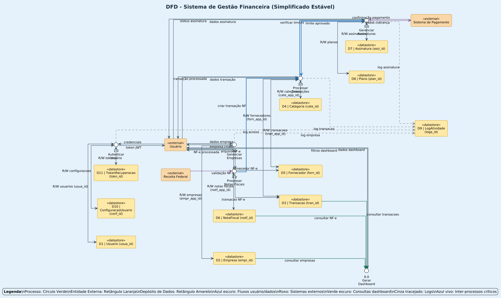
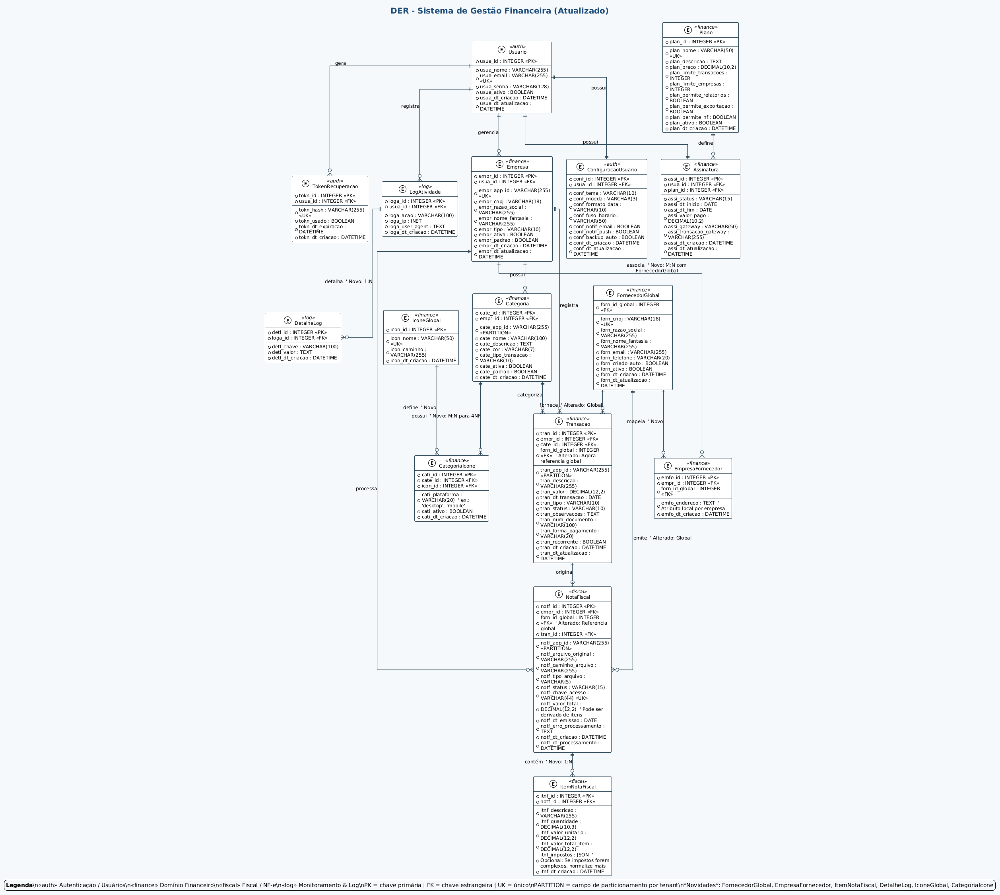
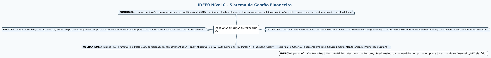
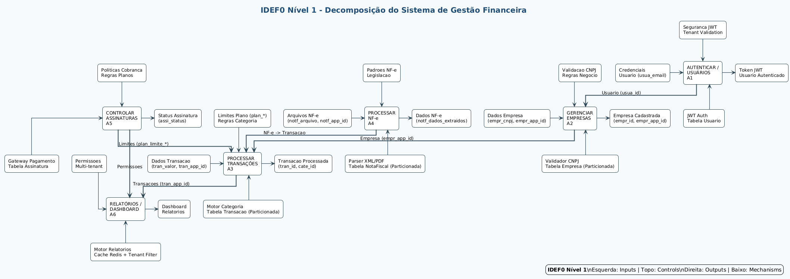

# Definição do Tema do Trabalho e Componentes do Grupo

## Tema do Trabalho

**Gestão Financeira para Empresas**  

O tema escolhido envolve o desenvolvimento de um sistema de gestão financeira destinado a empresas, incluindo funcionalidades como controle de transações, relatórios financeiros, gestão de assinaturas e integração com notas fiscais. O projeto será implementado utilizando tecnologias modernas, como Django para o backend e React Native para o aplicativo móvel.

## Componentes do Grupo

- Vinicius Silva
- Nikolas Eduardo Ramos de Oliveira
- Pedro Amorim Franco
- Paulo Henrique Gonçalves Vilela
- João Antônio Campos Jacintho de Oliveira Moraes
- Vinicius Shiro Nishie Kitazawa

## Tarefa 2: Diagramas do Sistema

### Descrição da Tarefa

**2-Tarefa - Criar o diagrama de IDEF0, Caso de uso, DFD e DER.**  
**Data de conclusão:** 19 de agosto de 2025 às 23:59  

**Instruções:** Conforme visto em aula, criar os diagramas dos aplicativos IDEF0 (nível 0 e nível 1), Caso de uso, DFD e DER do seu aplicativo que será entregue para a sociedade.

### Ordem Lógica dos Diagramas

Para uma apresentação clara e progressiva do sistema, os diagramas foram organizados na seguinte ordem lógica:

1. **Diagrama de Caso de Uso**: Inicia com a visão do usuário, mostrando as funcionalidades e atores externos.
2. **Diagrama de Fluxo de Dados (DFD)**: Demonstra como os dados fluem entre processos, entidades e depósitos.
3. **Diagrama de Entidade-Relacionamento (DER)**: Detalha a estrutura de dados e relacionamentos no banco.
4. **IDEF0 Nível 0**: Apresenta a função principal do sistema e seus ICOM (Inputs, Controls, Outputs, Mechanisms).
5. **IDEF0 Nível 1**: Decompõe a função principal em subfunções detalhadas.

### Descrições dos Diagramas

#### 1. Diagrama de Caso de Uso (`use-case-diagram.puml`)
**Perspectiva:** Visão do Usuário / Comportamento Externo  
**Pergunta que Responde:** "Quais são as funcionalidades que o sistema oferece e quem pode usá-las?"

**Funcionalidades Mapeadas:**
- **Autenticação:** Login, registro, recuperação de senha, configurações
- **Gestão de Empresas:** CRUD de empresas, definição de empresa padrão
- **Gestão Financeira:** CRUD de transações, categorias e fornecedores
- **Processamento Fiscal:** Upload e processamento de notas fiscais
- **Assinaturas:** Contratação, alteração e cancelamento de planos
- **Dashboard:** Visualização de relatórios e exportação de dados

**Atores:**
- **Usuário:** Pessoa física que utiliza o sistema
- **Sistema de Pagamento:** Gateway externo para processamento de pagamentos
- **Receita Federal:** Sistema externo para validação de NF-e

#### 2. Diagrama de Fluxo de Dados (`data-flow-diagram.puml`)
**Perspectiva:** Visão de Processamento / Fluxo de Informação  
**Pergunta que Responde:** "De onde vêm os dados, para onde vão e quais processos os transformam?"

**Processos Principais:**
1. **Autenticar Usuário** - Validação de credenciais e geração de tokens
2. **Gerenciar Empresas** - CRUD e validação de dados empresariais
3. **Processar Transações** - Criação, categorização e validação de transações
4. **Processar Notas Fiscais** - Upload, extração de dados e criação de transações
5. **Gerenciar Assinaturas** - Controle de planos e limites de uso
6. **Gerar Dashboard** - Agregação de dados para relatórios

**Depósitos de Dados:**
- D1: Usuários | D2: Empresas | D3: Transações | D4: Categorias
- D5: Fornecedores | D6: Notas Fiscais | D7: Assinaturas | D8: Planos | D9: Logs

#### 3. Diagrama de Entidade-Relacionamento (`entity-relationship-diagram.puml`)
**Perspectiva:** Visão de Dados / Estrutura de Armazenamento  
**Pergunta que Responde:** "Quais informações o sistema precisa armazenar e como elas estão estruturadas e conectadas?"

**Entidades Principais:**
- **Usuario:** Dados de autenticação e perfil
- **Empresa:** Informações empresariais (CNPJ, razão social)
- **Transacao:** Movimentações financeiras
- **NotaFiscal:** Documentos fiscais processados
- **Assinatura/Plano:** Controle de acesso e limites

**Relacionamentos Chave:**
- Usuario 1:N Empresa (um usuário pode ter várias empresas)
- Empresa 1:N Transacao (uma empresa tem várias transações)
- NotaFiscal 1:1 Transacao (uma NF pode gerar uma transação)
- Usuario 1:1 Assinatura (controle de plano ativo)

#### 4. Diagrama IDEF0 - Nível 0 (`idef0-level0.puml`)
**Perspectiva:** Visão Funcional / Análise de Processo de Negócio  
**Pergunta que Responde:** "Qual é a função principal do sistema e quais são seus ICOM?"

**Função Principal:** GERENCIAR FINANÇAS EMPRESARIAIS

**ICOM:**
- **Inputs:** Dados de usuários, empresas, transações, NF-e, fornecedores
- **Controls:** Legislação fiscal, regras de negócio, políticas de segurança
- **Outputs:** Relatórios, dashboard, dados categorizados, alertas
- **Mechanisms:** Django API, PostgreSQL, JWT, processador NF-e, Celery

#### 5. Diagrama IDEF0 - Nível 1 (`idef0-level1.puml`)
**Perspectiva:** Decomposição Funcional Detalhada  
**Pergunta que Responde:** "Quais são as subfunções do sistema e como elas interagem?"

**Subfunções:**
- **A1:** Autenticar e Gerenciar Usuários
- **A2:** Gerenciar Empresas
- **A3:** Processar Transações
- **A4:** Processar Notas Fiscais
- **A5:** Controlar Assinaturas
- **A6:** Gerar Relatórios e Dashboard

### Inclusão dos Diagramas no Documento

Os diagramas foram exportados para imagens (PNG) e incluídos nesta seção do documento Word para visualização. Cada diagrama é acompanhado de sua descrição detalhada acima.

#### Diagrama de Caso de Uso

#### Diagrama de Fluxo de Dados

#### Diagrama de Entidade-Relacionamento

#### IDEF0 Nível 0

#### IDEF0 Nível 1

